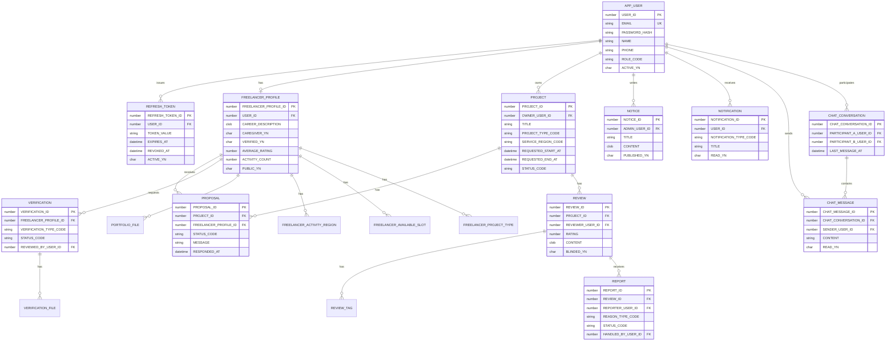

# 안심동행 - 이음 Backend

안심동행 - 이음 백엔드 저장소입니다. Spring Boot 기반 REST API 서버로, 사용자 인증, 프리랜서 프로필, 프로젝트 요청, 제안/매칭, 리뷰/신고, 인증 심사, 공지, 알림, 채팅, 파일 저장 기능을 제공합니다.

- Frontend Repository: [AIBE5_Project2_Team4_FE](https://github.com/prgrms-aibe-devcourse/AIBE5_Project2_Team4_FE)
- 기본 서버 포트: `8080`
- Swagger UI: `http://localhost:8080/swagger-ui/index.html`
- API Docs: `http://localhost:8080/v3/api-docs`

## 1. 프로젝트 개요

안심동행은 동행/돌봄 서비스가 필요한 사용자와 프리랜서 메이트를 연결하는 매칭 플랫폼입니다. 백엔드는 플랫폼의 핵심 도메인과 보안 정책, 데이터 영속성, 외부 연동을 담당합니다.

| 구분 | 주요 기능 |
| --- | --- |
| 인증/인가 | 이메일 로그인, 회원가입, JWT access/refresh token, 카카오 OAuth, 비밀번호 재설정 |
| 사용자 | 내 프로필, 마이페이지, 공개 프로필, 역할 기반 권한 관리 |
| 프리랜서 | 프리랜서 프로필, 활동 지역/시간/서비스 유형, 공개 여부, 포트폴리오 파일 |
| 프로젝트 | 서비스 요청 생성/조회/수정, 취소/수락/진행/완료 상태 전이 |
| 제안 | 프로젝트별 제안 생성, 프리랜서 제안함, 수락/거절 |
| 리뷰/신고 | 양방향 리뷰, 리뷰 태그, 리뷰 신고, 관리자 처리 |
| 인증 심사 | 프리랜서 인증 요청, 파일 업로드, 관리자 승인/반려 |
| 운영 | 관리자 대시보드, 공지사항, 프리랜서/프로젝트/리뷰/신고 관리 |
| 커뮤니케이션 | 알림, REST 기반 채팅, STOMP WebSocket 메시지 처리 |
| 외부 연동 | Kakao OAuth, AI 추천 서버 연동을 위한 WebClient 설정, SMTP 메일 |

## 2. 역할 분담

| 이름 | 역할 |
| --- | --- |
| 이상민 | 풀스택 |
| 김진필 | 백엔드 |
| 나윤하 | 백엔드, QA, 문서관리 |
| 최용성 | 백엔드 |

## 3. 브랜치 전략 & 커밋 규칙

### 브랜치 전략

| 브랜치 | 용도 |
| --- | --- |
| `main` | 배포 및 최종 통합 브랜치 |
| `feature/*` | 신규 기능 개발 |
| `feat/*` | 신규 기능 개발 보조 네이밍 |
| `fix/*` | 버그 수정 |
| `refactor/*` | 기능 변화 없는 구조 개선 |
| `docs/*` | 문서 수정 |
| `test/*` | 테스트 코드 및 검증 보강 |

개발 흐름은 `main`에서 작업 브랜치를 생성한 뒤 PR로 병합하는 방식을 기준으로 합니다. 기능 단위로 브랜치를 작게 유지하고, API 계약이 바뀌는 작업은 프론트엔드 저장소와 브랜치명을 맞춰 연동합니다.

### 커밋 규칙

커밋 메시지는 다음 형식을 사용합니다.

```text
type: 변경 내용 요약
```

| 타입 | 의미 |
| --- | --- |
| `feat` | 신규 기능 |
| `fix` | 버그 수정 |
| `refactor` | 리팩터링 |
| `docs` | 문서 변경 |
| `test` | 테스트 추가/수정 |
| `chore` | 빌드, 설정, 의존성 등 기타 작업 |
| `style` | 포맷팅 등 동작 변화 없는 변경 |

예시:

```text
feat: 프리랜서 인증 승인 API 추가
fix: 프로젝트 진행 인원 계산 오류 수정
test: 채팅 컨트롤러 통합 테스트 추가
```

## 4. 기술 스택

| 영역 | 기술 |
| --- | --- |
| Runtime | Java 21 |
| Framework | Spring Boot 3.3.6 |
| Build | Maven Wrapper |
| Web | Spring Web MVC, Spring Validation |
| Security | Spring Security, JWT, BCrypt |
| Persistence | Spring Data JPA, Hibernate, QueryDSL 5.1.0 |
| Database | Oracle Database, H2(Test) |
| Realtime | Spring WebSocket, STOMP |
| External Client | Spring WebFlux WebClient |
| Docs | springdoc-openapi 2.6.0, Swagger UI |
| Ops | Spring Boot Actuator |
| Mail/File | Spring Mail, local file storage |
| Utilities | Lombok, Configuration Processor |

## 5. 프로젝트 구조

```text
AIBE5_Project2_Team4_BE/
├─ .github/                         # GitHub 설정
├─ .mvn/                            # Maven Wrapper 설정
├─ src/
│  ├─ main/
│  │  ├─ java/com/ieum/ansimdonghaeng/
│  │  │  ├─ common/                 # 공통 응답, 예외, 보안, JWT, CORS, WebSocket, JPA 설정
│  │  │  ├─ domain/
│  │  │  │  ├─ admin/               # 관리자 대시보드/운영 API
│  │  │  │  ├─ auth/                # 로그인, 회원가입, 토큰, 카카오 OAuth, 비밀번호 재설정
│  │  │  │  ├─ chat/                # 채팅방, 메시지, STOMP 메시지 처리
│  │  │  │  ├─ code/                # 지역, 프로젝트 유형, 가능 시간 코드
│  │  │  │  ├─ file/                # 파일 조회/다운로드
│  │  │  │  ├─ freelancer/          # 프리랜서 프로필, 포트폴리오
│  │  │  │  ├─ notice/              # 공지사항
│  │  │  │  ├─ notification/        # 알림
│  │  │  │  ├─ project/             # 프로젝트 요청
│  │  │  │  ├─ proposal/            # 제안
│  │  │  │  ├─ recommendation/      # 추천 API 확장 지점
│  │  │  │  ├─ report/              # 리뷰 신고
│  │  │  │  ├─ review/              # 리뷰
│  │  │  │  ├─ user/                # 사용자
│  │  │  │  └─ verification/        # 프리랜서 인증 심사
│  │  │  └─ infra/ai/               # AI 서버 연동 WebClient 설정
│  │  └─ resources/                 # application-*.yml
│  └─ test/                         # 단위/통합 테스트, H2 테스트 설정
├─ storage/                         # 로컬 파일 저장소
├─ pom.xml
└─ README.md
```

관련 프론트엔드 저장소는 [AIBE5_Project2_Team4_FE](https://github.com/prgrms-aibe-devcourse/AIBE5_Project2_Team4_FE)입니다. 백엔드 API는 프론트엔드의 `src/api/*` 모듈에서 호출됩니다.

## 6. 필요한 환경 변수 예시

`.env.example`을 복사해 `.env`를 생성합니다. `application.yml`에서 `optional:file:.env[.properties]`로 로드합니다.

```bash
cp .env.example .env
```

```env
SPRING_PROFILES_ACTIVE=local
SERVER_PORT=8080

DB_URL=jdbc:oracle:thin:@localhost:1521/XEPDB1
DB_USERNAME=ansimdonghaeng
DB_PASSWORD=change-me

JWT_SECRET=replace-with-a-long-random-secret-value
JWT_ISSUER=ansimdonghaeng
JWT_ACCESS_TOKEN_EXPIRATION_MINUTES=60
JWT_REFRESH_TOKEN_EXPIRATION_MINUTES=10080

CORS_ALLOWED_ORIGINS=http://localhost:5173,http://127.0.0.1:5173,http://localhost:3000,http://127.0.0.1:3000
WEBSOCKET_ENDPOINT=/ws

KAKAO_USER_INFO_URI=https://kapi.kakao.com/v2/user/me
KAKAO_TOKEN_URI=https://kauth.kakao.com/oauth/token
KAKAO_REST_API_KEY=your-kakao-rest-api-key
KAKAO_CLIENT_SECRET=your-kakao-client-secret
KAKAO_REDIRECT_URI=http://localhost:5173/login/kakao/callback
KAKAO_CONNECT_TIMEOUT_MILLIS=3000
KAKAO_RESPONSE_TIMEOUT_MILLIS=5000

AI_BASE_URL=https://example.invalid
AI_CONNECT_TIMEOUT_MILLIS=3000
AI_RESPONSE_TIMEOUT_MILLIS=5000

FILE_STORAGE_BASE_DIR=./storage/local
MULTIPART_MAX_FILE_SIZE=20MB
MULTIPART_MAX_REQUEST_SIZE=25MB

PASSWORD_RESET_TOKEN_EXPIRATION_MINUTES=10
PASSWORD_RESET_URL_BASE=http://localhost:5173/reset-password

MAIL_ENABLED=false
MAIL_HOST=smtp.gmail.com
MAIL_PORT=587
MAIL_USERNAME=your-email@example.com
MAIL_PASSWORD=your-email-password-or-app-password
MAIL_FROM=no-reply@ansimdonghaeng.com
```

프로필별 DB 설정:

| Profile | DB | JPA DDL | 용도 |
| --- | --- | --- | --- |
| `local` | Oracle | `none` | 로컬 개발 |
| `dev` | Oracle | `validate` | 개발 서버 |
| `prod` | Oracle | `validate` | 운영 서버 |
| `test` | H2 Oracle Mode | `create-drop` | 자동 테스트 |

## 7. ERD / DB 구조

핵심 엔티티 관계는 다음과 같습니다.



### 주요 테이블

| 테이블 | 설명 |
| --- | --- |
| `APP_USER` | 사용자 계정, 역할, 활성 상태 |
| `REFRESH_TOKEN` | refresh token 발급/만료/폐기 상태 |
| `FREELANCER_PROFILE` | 프리랜서 프로필, 인증 여부, 평점/활동 수 |
| `FREELANCER_ACTIVITY_REGION` | 프리랜서 활동 지역 코드 |
| `FREELANCER_AVAILABLE_SLOT` | 프리랜서 가능 시간대 코드 |
| `FREELANCER_PROJECT_TYPE` | 프리랜서 가능 서비스 유형 코드 |
| `PORTFOLIO_FILE` | 프리랜서 포트폴리오 파일 메타데이터 |
| `PROJECT` | 사용자가 등록한 서비스 요청 |
| `PROPOSAL` | 프로젝트에 대한 프리랜서 제안 |
| `REVIEW`, `REVIEW_TAG`, `REVIEW_TAG_CODE` | 리뷰, 리뷰 태그, 태그 코드 |
| `REPORT` | 리뷰 신고 및 관리자 처리 상태 |
| `VERIFICATION`, `VERIFICATION_FILE` | 프리랜서 인증 요청 및 증빙 파일 |
| `NOTICE` | 관리자 공지사항 |
| `NOTIFICATION` | 사용자 알림 |
| `CHAT_CONVERSATION`, `CHAT_MESSAGE` | 채팅방과 메시지 |
| `PROJECT_TYPE_CODE`, `REGION_CODE`, `AVAILABLE_TIME_SLOT_CODE` | 공통 코드 |

감사 컬럼은 `BaseAuditEntity`를 사용하는 엔티티에 `created_at`, `updated_at`으로 포함됩니다.

## 8. API 명세

공통 응답 형식:

```json
{
  "success": true,
  "data": {},
  "error": null
}
```

인증이 필요한 API는 다음 헤더를 사용합니다.

```http
Authorization: Bearer <accessToken>
```

상세 request/response 스키마는 서버 실행 후 Swagger UI에서 확인합니다.

```text
http://localhost:8080/swagger-ui/index.html
```

| 도메인 | Method | Path | 설명 | 인증 |
| --- | --- | --- | --- | --- |
| Auth | `POST` | `/api/v1/auth/signup` | 회원가입 | Public |
| Auth | `POST` | `/api/v1/auth/login` | 로그인 | Public |
| Auth | `POST` | `/api/v1/auth/oauth/kakao` | 카카오 OAuth 로그인 | Public |
| Auth | `POST` | `/api/v1/auth/refresh` | 토큰 갱신 | Public |
| Auth | `POST` | `/api/v1/auth/reissue` | 토큰 재발급 호환 엔드포인트 | Public |
| Auth | `POST` | `/api/v1/auth/logout` | 로그아웃 및 refresh token 폐기 | Auth |
| Auth | `POST` | `/api/v1/auth/forgot-password` | 비밀번호 재설정 메일/토큰 요청 | Public |
| Auth | `POST` | `/api/v1/auth/reset-password` | 비밀번호 재설정 | Public |
| User | `GET` | `/api/v1/users/me` | 내 프로필 조회 | Auth |
| User | `PATCH` | `/api/v1/users/me` | 내 프로필 수정 | Auth |
| User | `GET` | `/api/v1/users/me/mypage` | 마이페이지 요약 | Auth |
| User | `GET` | `/api/v1/users/{userId}/public-profile` | 공개 사용자 프로필 | Public |
| Code | `GET` | `/api/v1/codes/project-types` | 프로젝트 유형 코드 | Public |
| Code | `GET` | `/api/v1/codes/regions` | 지역 코드 | Public |
| Code | `GET` | `/api/v1/codes/available-time-slots` | 가능 시간대 코드 | Public |
| Freelancer | `GET` | `/api/v1/freelancers` | 공개 프리랜서 목록 | Public |
| Freelancer | `GET` | `/api/v1/freelancers/{freelancerProfileId}` | 공개 프리랜서 상세 | Public |
| Freelancer | `POST` | `/api/v1/freelancers/me/profile` | 내 프리랜서 프로필 생성 | Auth |
| Freelancer | `GET` | `/api/v1/freelancers/me/profile` | 내 프리랜서 프로필 조회 | Auth |
| Freelancer | `PATCH` | `/api/v1/freelancers/me/profile` | 내 프리랜서 프로필 수정 | Auth |
| Freelancer File | `POST` | `/api/v1/freelancers/me/files` | 포트폴리오 파일 업로드 | Auth |
| Freelancer File | `GET` | `/api/v1/freelancers/me/files` | 내 포트폴리오 파일 목록 | Auth |
| Freelancer File | `DELETE` | `/api/v1/freelancers/me/files/{fileId}` | 포트폴리오 파일 삭제 | Auth |
| File | `GET` | `/api/v1/files/{fileKey}` | 파일 조회 | Public |
| File | `GET` | `/api/v1/files/{fileKey}/download` | 파일 다운로드 | Public |
| Verification | `POST` | `/api/v1/freelancers/me/verifications` | 인증 요청 생성 | Auth |
| Verification | `GET` | `/api/v1/freelancers/me/verifications` | 내 인증 요청 목록 | Auth |
| Verification | `GET` | `/api/v1/freelancers/me/verifications/{verificationId}` | 인증 요청 상세 | Auth |
| Verification | `POST` | `/api/v1/freelancers/me/verifications/{verificationId}/files` | 인증 파일 업로드 | Auth |
| Verification | `GET` | `/api/v1/freelancers/me/verifications/{verificationId}/files` | 인증 파일 목록 | Auth |
| Verification | `DELETE` | `/api/v1/freelancers/me/verifications/files/{fileId}` | 인증 파일 삭제 | Auth |
| Project | `POST` | `/api/v1/projects` | 프로젝트 생성 | Auth |
| Project | `GET` | `/api/v1/projects/me` | 내 프로젝트 목록 | Auth |
| Project | `GET` | `/api/v1/projects` | 프로젝트 목록 | Auth |
| Project | `GET` | `/api/v1/projects/{projectId}` | 프로젝트 상세 | Auth |
| Project | `PATCH` | `/api/v1/projects/{projectId}` | 프로젝트 수정 | Auth |
| Project | `PATCH` | `/api/v1/projects/{projectId}/cancel` | 프로젝트 취소 | Auth |
| Project | `PATCH` | `/api/v1/projects/{projectId}/start` | 프로젝트 진행 시작 | Auth |
| Project | `PATCH` | `/api/v1/projects/{projectId}/complete` | 프로젝트 완료 | Auth |
| Proposal | `GET` | `/api/v1/projects/{projectId}/proposals` | 프로젝트 제안 목록 | Auth |
| Proposal | `POST` | `/api/v1/projects/{projectId}/proposals` | 프로젝트에 제안 생성 | Auth |
| Proposal | `GET` | `/api/v1/freelancers/me/proposals` | 내 프리랜서 제안 목록 | Auth |
| Proposal | `GET` | `/api/v1/freelancers/me/proposals/{proposalId}` | 제안 상세 | Auth |
| Proposal | `PATCH` | `/api/v1/freelancers/me/proposals/{proposalId}/accept` | 제안 수락 | Auth |
| Proposal | `PATCH` | `/api/v1/freelancers/me/proposals/{proposalId}/reject` | 제안 거절 | Auth |
| Review | `POST` | `/api/v1/projects/{projectId}/reviews` | 프리랜서 대상 리뷰 작성 | Auth |
| Review | `POST` | `/api/v1/projects/{projectId}/requester-reviews` | 요청자 대상 리뷰 작성 | Auth |
| Review | `GET` | `/api/v1/users/me/reviews` | 내가 작성한 리뷰 | Auth |
| Review | `GET` | `/api/v1/users/me/received-reviews` | 내가 받은 리뷰 | Auth |
| Review | `GET` | `/api/v1/users/me/reviews/{reviewId}` | 내 리뷰 상세 | Auth |
| Review | `PATCH` | `/api/v1/users/me/reviews/{reviewId}` | 내 리뷰 수정 | Auth |
| Review | `DELETE` | `/api/v1/users/me/reviews/{reviewId}` | 내 리뷰 삭제 | Auth |
| Review | `GET` | `/api/v1/freelancers/{freelancerProfileId}/reviews` | 공개 프리랜서 리뷰 | Public |
| Review | `GET` | `/api/v1/reviews/tag-codes` | 리뷰 태그 코드 | Public |
| Report | `POST` | `/api/v1/reviews/{reviewId}/reports` | 리뷰 신고 | Auth |
| Report | `GET` | `/api/v1/reports/me` | 내 신고 목록 | Auth |
| Notice | `GET` | `/api/v1/notices` | 공지사항 목록 | Public |
| Notice | `GET` | `/api/v1/notices/{noticeId}` | 공지사항 상세 | Public |
| Notification | `GET` | `/api/v1/notifications` | 내 알림 목록 | Auth |
| Notification | `GET` | `/api/v1/notifications/{notificationId}` | 알림 상세 | Auth |
| Notification | `PATCH` | `/api/v1/notifications/{notificationId}/read` | 알림 읽음 처리 | Auth |
| Notification | `PATCH` | `/api/v1/notifications/read-all` | 모든 알림 읽음 처리 | Auth |
| Notification | `DELETE` | `/api/v1/notifications/{notificationId}` | 알림 삭제 | Auth |
| Chat | `GET` | `/api/v1/chats/conversations` | 채팅방 목록 | Auth |
| Chat | `POST` | `/api/v1/chats/conversations` | 채팅방 생성 | Auth |
| Chat | `GET` | `/api/v1/chats/{conversationId}/messages` | 채팅 메시지 목록 | Auth |
| Chat | `POST` | `/api/v1/chats/{conversationId}/messages` | 채팅 메시지 전송 | Auth |
| Chat | `PATCH` | `/api/v1/chats/{conversationId}/read` | 채팅방 읽음 처리 | Auth |
| Chat WS | `MESSAGE` | `/app/chats/{conversationId}/send` | STOMP 메시지 전송 | Auth |
| Admin | `GET` | `/api/v1/admin/dashboard` | 관리자 대시보드 | Admin |
| Admin | `GET` | `/api/v1/admin/verifications` | 인증 요청 목록 | Admin |
| Admin | `GET` | `/api/v1/admin/verifications/{verificationId}` | 인증 요청 상세 | Admin |
| Admin | `PATCH` | `/api/v1/admin/verifications/{verificationId}/approve` | 인증 승인 | Admin |
| Admin | `PATCH` | `/api/v1/admin/verifications/{verificationId}/reject` | 인증 반려 | Admin |
| Admin | `GET` | `/api/v1/admin/projects` | 프로젝트 관리 목록 | Admin |
| Admin | `GET` | `/api/v1/admin/projects/{projectId}` | 프로젝트 관리 상세 | Admin |
| Admin | `PATCH` | `/api/v1/admin/projects/{projectId}/cancel` | 관리자 프로젝트 취소 | Admin |
| Admin | `GET` | `/api/v1/admin/freelancers` | 프리랜서 관리 목록 | Admin |
| Admin | `GET` | `/api/v1/admin/freelancers/{freelancerProfileId}` | 프리랜서 관리 상세 | Admin |
| Admin | `PATCH` | `/api/v1/admin/freelancers/{freelancerProfileId}/visibility` | 프리랜서 공개 여부 변경 | Admin |
| Admin | `PATCH` | `/api/v1/admin/freelancers/{freelancerProfileId}/active` | 프리랜서 활성 상태 변경 | Admin |
| Admin | `GET` | `/api/v1/admin/reviews` | 리뷰 관리 목록 | Admin |
| Admin | `PATCH` | `/api/v1/admin/reviews/{reviewId}/blind` | 리뷰 블라인드 | Admin |
| Admin | `PATCH` | `/api/v1/admin/reviews/{reviewId}/unblind` | 리뷰 블라인드 해제 | Admin |
| Admin | `GET` | `/api/v1/admin/reports` | 신고 관리 목록 | Admin |
| Admin | `GET` | `/api/v1/admin/reports/{reportId}` | 신고 상세 | Admin |
| Admin | `PATCH` | `/api/v1/admin/reports/{reportId}/resolve` | 신고 처리 | Admin |
| Admin | `PATCH` | `/api/v1/admin/reports/{reportId}/reject` | 신고 반려 | Admin |
| Admin | `POST` | `/api/v1/admin/notices` | 공지 생성 | Admin |
| Admin | `PATCH` | `/api/v1/admin/notices/{noticeId}` | 공지 수정 | Admin |
| Admin | `DELETE` | `/api/v1/admin/notices/{noticeId}` | 공지 삭제 | Admin |
| Admin | `PATCH` | `/api/v1/admin/notices/{noticeId}/publish` | 공지 발행 | Admin |

추천 도메인은 `/api/v1/recommendations` 기본 컨트롤러와 AI 연동 설정이 준비되어 있으며, 세부 추천 엔드포인트는 고도화 대상입니다.

## 9. 테스트 방법

### 로컬 실행

Windows:

```bash
.\mvnw.cmd spring-boot:run
```

macOS/Linux:

```bash
./mvnw spring-boot:run
```

### 전체 테스트

Windows:

```bash
.\mvnw.cmd test
```

macOS/Linux:

```bash
./mvnw test
```

테스트는 `test` 프로필과 H2 Oracle Mode를 사용합니다. 주요 테스트 범위는 인증, 보안 예외 응답, 관리자 API, 프리랜서/프로젝트/제안/리뷰/신고/알림/채팅/파일/인증 API 통합 테스트입니다.

### 빌드

Windows:

```bash
.\mvnw.cmd clean package
```

macOS/Linux:

```bash
./mvnw clean package
```

## 10. 트러블슈팅

추후 추가 예정

## 11. 향후 개선 방향

- AI 매칭 고도화 및 추천 이유 출력
- 채팅 암호화 적용
- 알림 시스템 확장
